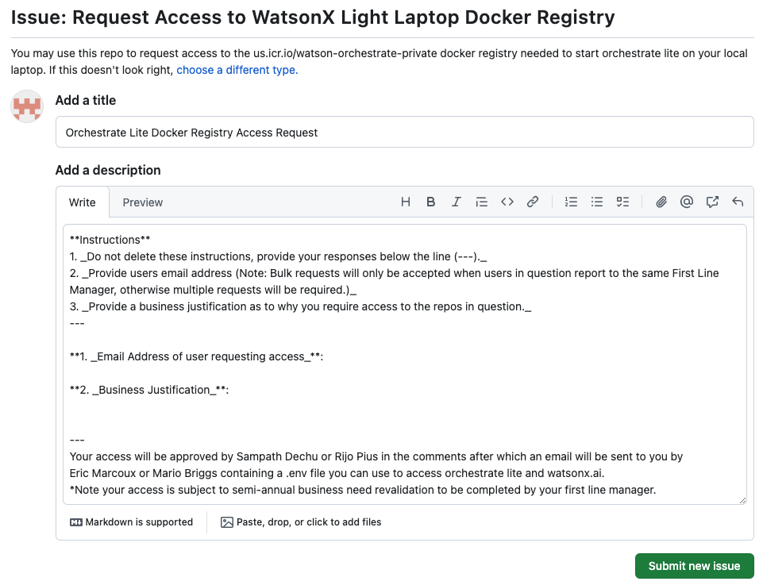
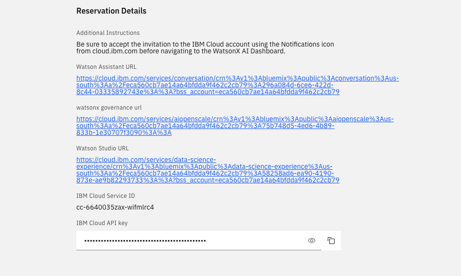
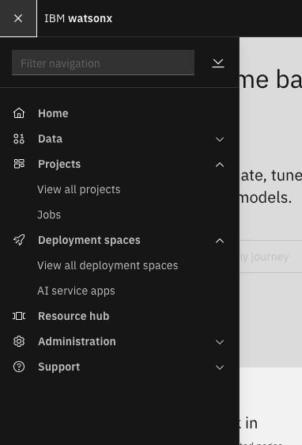
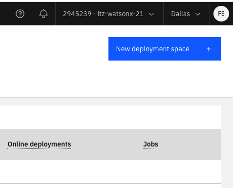
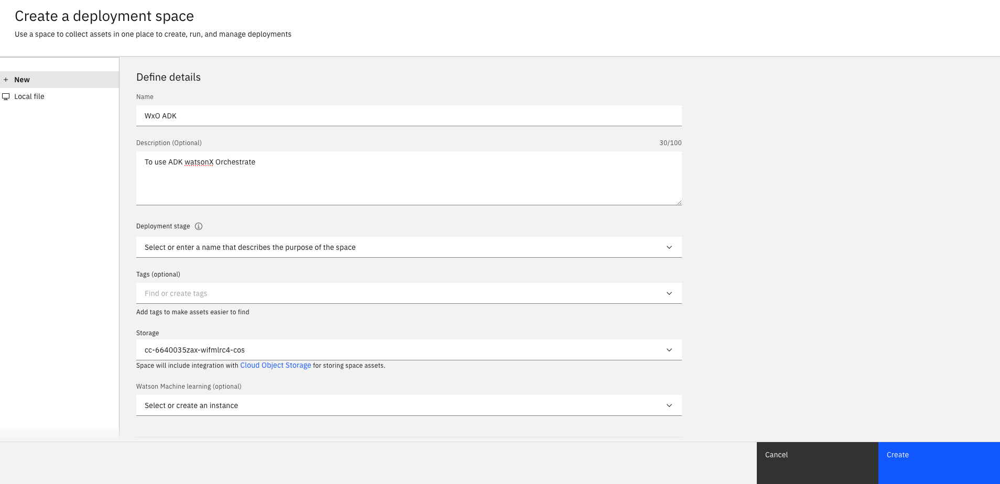
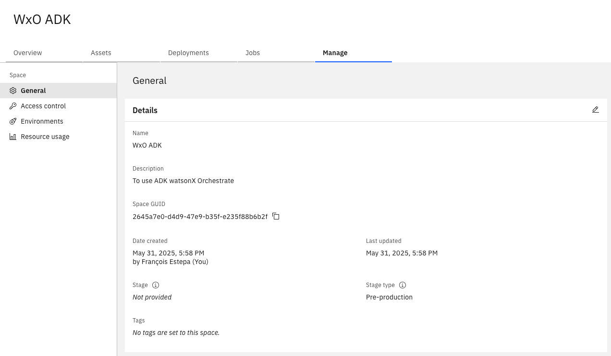

# WastonX Orchestrate

Git pour utiliser WatsonX Orchestrate Agentique

## 📦 Prérequis

- [Python 3.12+](https://www.python.org/)
- [watsonx Agent Development Kit (ADK)](https://developer.watson-orchestrate.ibm.com)
- [Un compte IBM Cloud avec accès à watsonx Orchestrate](https://cloud.ibm.com/)
- [Un compte IBM Cloud avec accès à watsonx AI](https://cloud.ibm.com/)

---

## Installation

Avant de pouvoir importer et exécuter tes agents et tes tools dans watsonx Orchestrate, il faut configurer ton environnement de développement local avec les variables nécessaires à l'exécution du runtime en mode développeur.

### 📄 Étape 1 : Créer un fichier `.env`

À la racine de ton projet, crée un fichier nommé `.env` et colle-y le contenu suivant :

```env
WO_DEVELOPER_EDITION_SOURCE=internal
DOCKER_IAM_KEY="votre-clé-Docker-IAM"
OPENSOURCE_REGISTRY_PROXY=us.icr.io/watson-orchestrate-private
WO_ENTITLEMENT_KEY="votre-clé-d'entitlement-IBM"
WATSONX_APIKEY="votre-API-key-Watsonx"
WATSONX_SPACE_ID="votre-ID-d'espace-Watsonx"
```

### 🔑 Où trouver ces clés ?

#### 🔹 `DOCKER_IAM_KEY`

Clé d’authentification pour télécharger les images nécessaires au runtime local.

- Va sur : [https://github.ibm.com/WatsonOrchestrate/wxo-clients/issues/new/choose](https://github.ibm.com/WatsonOrchestrate/wxo-clients/issues/new/choose)
- Clique sur **"Get started"**pour faire une demande. La clée sera envoyé par email après validation des équipes IBM.



- Copie la clé et colle-la dans `DOCKER_IAM_KEY`

---

#### 🔹 `WO_ENTITLEMENT_KEY`

Clé donnant accès aux images privées d’IBM dans le container registry.

- Va sur : [https://myibm.ibm.com/products-services/containerlibrary](https://myibm.ibm.com/products-services/containerlibrary)
- Si ta clé n'éxiste pas Clique sur **"Add new key"**
- Copie la clé et colle-la dans `WO_ENTITLEMENT_KEY`


---

#### 🔹 `WATSONX_APIKEY`

Clé d’accès aux modèles d’IA et services dans Watsonx.ai.

- Va sur ta réservation techzone (Par exemple: [Techzone environnement](https://techzone.ibm.com/my/reservations/create/64e6866b41bf2a0017d986ad))
- En bas de ta page récupère dans la partie **Reservation Details** la IBM Cloud API Key



- Colle-la dans `WATSONX_APIKEY`

---

#### 🔹 `WATSONX_SPACE_ID`

Identifiant unique de l’espace de deployment Watsonx.AI.

- Va sur ton environnement WatsonX.AI et clique sur "View all deployment spaces"



- Clique sur **"New deployment space"**



- Donne un nom et un description puis clique sur **Create**



- Clique sur l'onglet **Manage** et récupère le **Space GUID**



- Colle-le dans `WATSONX_SPACE_ID`

### 📄 Étape 2 : lancer les lignes de commande pour l'installation

#### 1) 🐍 Environnement virtuel : création

```bash
python3.12 -m venv venv
source venv/bin/activate
```

---

#### 2) ⬆️ Installer/mettre à jour le package

Si tu veux installer ou mettre à jour `ibm-watsonx-orchestrate` depuis Test PyPI :

```bash
pip install --upgrade \
  --index-url https://test.pypi.org/simple/ \
  --extra-index-url https://pypi.org/simple \
  ibm-watsonx-orchestrate
```

---

#### 3) 🚀 Commandes serveur

```bash
orchestrate server start --env-file .env
orchestrate env activate local --registry testpypi
```

---

#### 4) 📥 Import des tools et agents

- Se mettre dans le dossier ou sont situés vos tools et agents et effectuer les commandes suivantes: (Changer le nom de vos fichiers dans la ligne de commande)

```bash
# Tools utilisateurs
orchestrate tools import -k python -f ./find_user_id.py -r ./requirements.txt  

# Agent principal
orchestrate agents import -f TI_Process_Closure_Agent.yaml

```

---

#### 5) 💬 Démarrer le chat

```bash
orchestrate chat start
```
